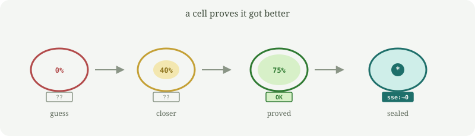

# demostrante

A small Rust program that searches for a better piece of its own source, then **writes a child only if it can prove the change is better**.

It is not a language model and it does not spread by itself. You point it at a folder; it only writes there.

It is a sibling of [mejorante](https://github.com/PascualMacana/mejorante). Darwin still proposes (random mutants, frozen scoring). Gödel accepts: a child is born because a certificate checks, not because the searcher got lucky.

The part that evolves is a tiny math expression called the **brain**. The program tries to match this function:

```
f(x) = x² + 3x + 5
```

on `x = -5 … 5`. Score is the sum of squared errors (**sse**). Lower is better. Zero is a perfect fit.

A proof is just that check, written down:

```
parent    brain  0                              sse  4323
  │ evolve (search)
  │ prove  (re-evaluate all 11 points)
  ▼
child     brain  (+ (+ (* 3 x) (* x x)) 5)      sse  0
          parent 0
          proof  sse:4323.0000->0.0000
```

Anyone can re-run the 11 points. If the numbers do not match, the certificate is a lie and nothing is written.



Watch it happen in the terminal. The body fills as the error drops. A seal under the cell inks only when the current brain would beat the parent. `dish` defaults to seed 7.

```bash
cargo run -- dish
```

## Run it

You need [Rust](https://rustup.rs/).

```bash
cargo build --release
./target/release/demostrante identity
./target/release/demostrante prove
./target/release/demostrante evolve --steps 120 --spawn ./hijo --build
./hijo/target/debug/demostrante identity
./hijo/target/debug/demostrante prove
```

`identity` prints generation, brain, parent, and whether the proof verifies.  
`evolve --spawn ./hijo --build` searches, **refuses to write** if there is no improvement, otherwise writes a child that carries the certificate.

`spawn ./hijo` without `evolve` copies this genome and does **not** claim an improvement.

## Commands

```
demostrante identity              generation, lineage, parent, proof, score
demostrante eval [x]              brain vs the target function
demostrante prove [expr]          check this individual's proof, or a candidate
demostrante evolve                search for a better brain
                 --steps N      search steps (default 120)
                 --lambda L     mutants per step (default 30)
                 --seed S       reproducible RNG
                 --spawn <dir>  write a child if the proof checks
                 --build        compile that child
                 --force        overwrite a previous child
                 --write        update src/main.rs if the proof checks
demostrante dish                  animate a cell and a seal
                 --steps N      search steps (default 120)
                 --lambda L     mutants per step (default 30)
                 --seed S       default 7 (the reliable demo)
                 --delay MS     ms per frame (default 80)
demostrante spawn <dir>           copy the current genome (no claim)
demostrante genome                print the embedded sources
```

## How it works

The brain lives in a constant in `src/main.rs`. So do the parent brain and the proof string.

1. Parse the current brain into a tree.
2. Each step makes several random mutants. Keep the lowest `sse + 0.01 × size`.
3. After a perfect fit, algebraic identities may shrink the expression.
4. A proof of `A → B` holds if, on `x = -5 … 5`, `sse(B) < sse(A)`, or the sse is equal and `B` is smaller.
5. `--spawn` / `--write` re-evaluate that claim. Only then do they patch `BRAIN`, `PARENT_BRAIN`, and `PROOF`.

The scoring function never changes. This is not a Red Queen: the world stays still. It is not Schmidhuber's Gödel Machine: there is no general theorem prover. The certificate is the 11 points.

## Safety

- One child per run. No background loops, no network.
- It will not write over your home directory, `/`, `/usr`, `/etc`, or the directory you are standing in.
- `--force` only deletes a folder that already looks like a `demostrante` project.
- A copy (`spawn` without search) does not need a proof. A claimed improvement does.

## Related

[replicante](https://github.com/PascualMacana/replicante) copies itself.  
[mejorante](https://github.com/PascualMacana/mejorante) copies itself and also tries to improve, without asking for a proof.  
[reinante](https://github.com/PascualMacana/reinante) keeps searching because the scoring function itself moves.
